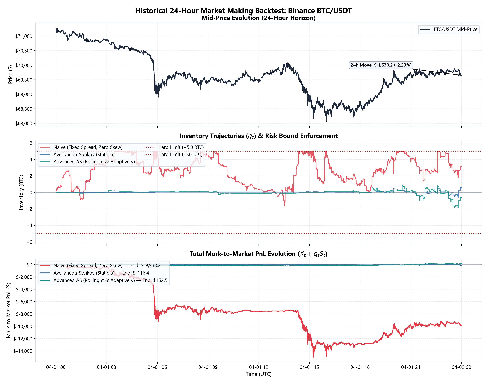
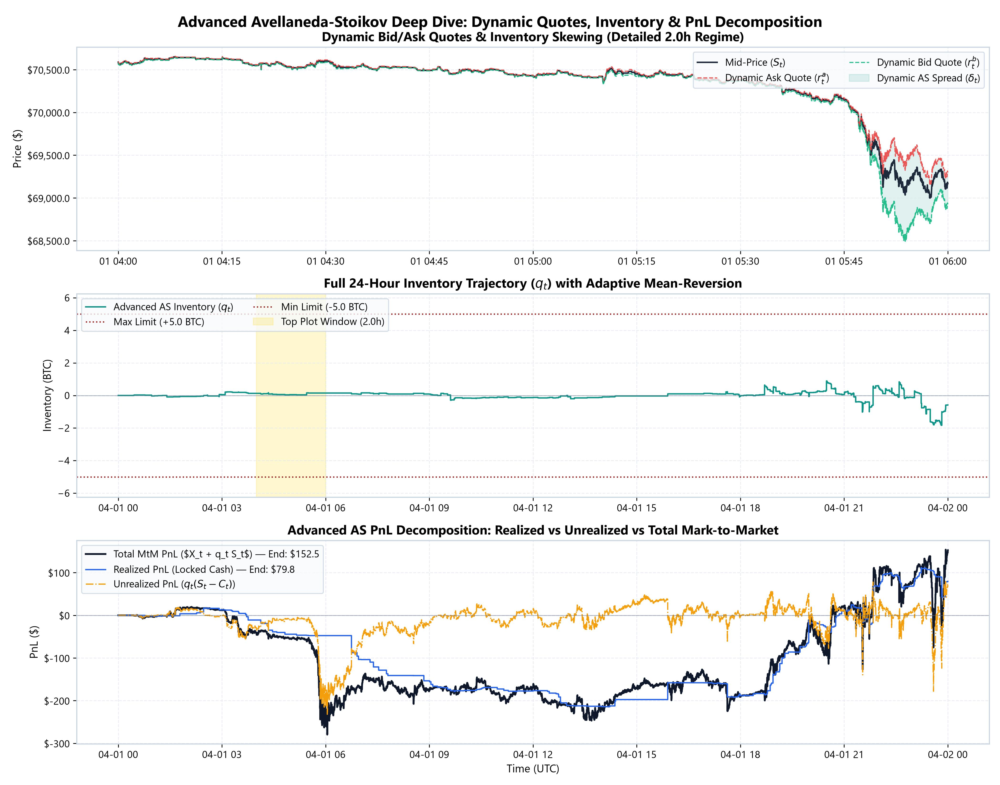
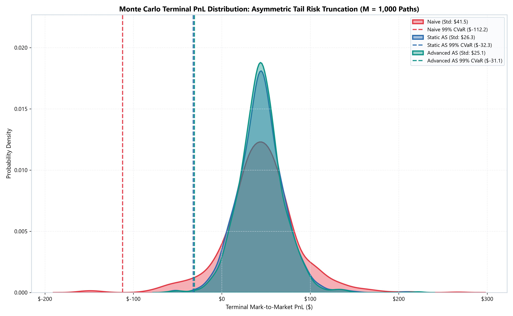

# Optimal Inventory Management: High-Frequency Market Making Engine & Monte Carlo Framework

A quantitative finance framework implementing high-frequency market making strategies based on the **Avellaneda-Stoikov (2008)** framework, featuring tick-level historical backtesting with limit order book (LOB) queue realism on Binance BTC/USDT and Monte Carlo risk simulations with adverse selection dynamics.

---

## 1. Project Overview & Architecture

This repository evaluates the efficacy of optimal inventory control in high-frequency trading (HFT) across three paradigms:
1. **Naive Market Making**: Symmetric quotes around mid-price with fixed spread and zero inventory sensitivity.
2. **Avellaneda-Stoikov (Static $\sigma$)**: Static session volatility $\sigma_0$ with reservation price skewed linearly by inventory $q_t$.
3. **Advanced Avellaneda-Stoikov**: Dynamic rolling volatility $\sigma_t$ (5-minute rolling window) and non-linear adaptive risk aversion $\gamma(q_t)$, featuring quadratic penalty scaling as inventory approaches hard risk limits.

Specifically, the repository systematically compares the three paradigms to isolate the impact of dynamic spread widening and asymmetric quote skewing on capital preservation.

### Directory Structure
```
Opt_inv_management/
├── data/
│   ├── binance_book_ticker_2024-04-01_BTCUSDT.csv.gz  # Top-of-book L1 state (~5.62M rows)
│   └── binance_trades_2024-04-01_BTCUSDT.csv.gz       # Executed market orders (~1.89M rows)
├── figures/
│   ├── historical_3way_comparison.jpg                 # Figure 1: 3-way 24h backtest with LOB realism
│   ├── advanced_as_deep_dive.jpg                      # Figure 2: Dynamic quotes & PnL decomposition
│   └── monte_carlo_pnl_distribution.jpg               # Figure 3: Terminal PnL KDE, 99% CVaR & Tail Risk
├── src/
│   ├── __init__.py
│   ├── data_loader.py                                 # Causal merge_asof parser
│   ├── calibration.py                                 # Poisson intensity & volatility fitting
│   ├── strategy.py                                    # MM Strategy implementations
│   ├── backtester.py                                  # Modular MatchingEngine & Numba-accelerated LOB simulator
│   ├── monte_carlo.py                                 # 1,000-path Jump-Diffusion & Adverse Selection Engine
│   ├── metrics.py                                     # Skewness, 99% VaR, 99% CVaR & binned Sharpe
│   └── visualization.py                               # Publication-quality figure generation
├── main.py                                            # Master pipeline orchestrator
└── README.md                                          # Quantitative documentation
```

---

## 2. Microstructural Realism & Matching Engine

Real-world high-frequency market making does not take place in a frictionless, instantaneous environment. The refactored matching engine incorporates four pillars of limit order book realism:

### 2.1 Limit Order Book Queue Position Estimation
Market makers cannot execute instantly at the touch. Limit orders must wait in line:
- **Queue Placement**: When a limit order is placed at price $p$:
  - If $p = p_{\text{touch}}$, the order is assigned behind the visible L1 volume: $Q_{\text{ahead}} = V_{\text{L1}}$.
  - If $p$ improves the touch, $Q_{\text{ahead}} = 0$ (front of the book).
  - If $p$ is behind the touch, $Q_{\text{ahead}} = V_{\text{L1}} + \rho_{\text{depth}} \cdot |p - p_{\text{touch}}|$.
- **Queue Consumption**: Aggressive incoming market orders consume queue volume ahead:
  $$Q_{\text{ahead}} \leftarrow \max(0, Q_{\text{ahead}} - V_{\text{trade}})$$
- **Stochastic Cancellations**: Unfilled competing orders ahead in the queue cancel over time:
  $$Q_{\text{ahead}}(t + \Delta t) = Q_{\text{ahead}}(t) \cdot \exp(-\lambda_{\text{cancel}} \Delta t)$$
- **Execution Condition**: An order can only fill after $Q_{\text{ahead}} \le 0$.

### 2.2 Network & Processing Latency (`latency_ms` = 50.0 ms)
- **Market Data Feed Latency**: At time $t$, the strategy observes delayed market prices and volatility from $t_{\text{obs}} = t - \text{latency ms}$.
- **Order Wire Delay**: Quotes placed or cancelled at time $t$ require `latency_ms` transit before activating at the exchange matching engine.
- Stale quotes remain exposed at the exchange during rapid price swings, introducing real-world latency-induced adverse selection.

### 2.3 Hawkes Process & Probabilistic Book-Shape Fills
- **Hawkes Toxic Flow**: Incoming market order intensity clusters dynamically according to a self-exciting Hawkes process:
  $$\lambda_t = \mu_0 + (\lambda_{t-1} - \mu_0) e^{-\beta \Delta t} + \alpha \cdot \mathbf{1}_{\{\text{market trade}\}}$$
  Excitation bursts simulate clustered toxic order flow that rapidly wipes out queue depth.
- **Probabilistic Fill Rate**: Fills are not deterministic at the touch; the probability of execution accounts for the exponential decay of book shape:
  $$\mathbb{P}(\text{fill} \mid \delta) = \exp(-\kappa \cdot \delta)$$
  where $\delta$ is the distance to the prevailing mid-price.

### 2.4 Strict Maker Fee Accounting
- Passive limit order executions incur maker fees deducted directly from cash:
  $$\text{Fee} = p_{\text{fill}} \cdot \text{lot size} \cdot \text{maker fee}$$
- Calibrated at **0.5 bps** ($0.00005$, institutional VIP maker tier).

---

## 3. Mathematical Framework & Metric Clarifications

### 3.1 Problem Formulation & Theoretical Framework (HJB)

A high-frequency market maker earns the bid-ask spread by quoting limit orders on both sides of the book. However, holding unhedged positions exposes the dealer to **inventory risk** (adverse price drift while holding inventory).

#### Asset Dynamics & Order Execution
The reference mid-price follows an arithmetic Brownian motion on a filtered probability space:
$$dS_t = \sigma dW_t$$

Limit order fill rates follow Poisson point processes with intensities decaying exponentially with the quote distance $\delta$ from the mid-price:
$$\lambda^a(\delta_t^a) = A e^{-k \delta_t^a}, \quad \lambda^b(\delta_t^b) = A e^{-k \delta_t^b}$$
where $A$ is the baseline arrival rate, $k$ is the liquidity density, and $\delta^a, \delta^b$ are the distances of the ask and bid quotes from the mid-price.

#### Stochastic Optimal Control (HJB Formulation)
With cash $X_t$ and inventory $q_t$, the terminal wealth at horizon $T$ is $\Pi_T = X_T + q_T S_T$. Assuming Constant Absolute Risk Aversion (CARA) with risk coefficient $\gamma > 0$, the value function solves:
$$\max_{(\delta_t^a, \delta_t^b)} \mathbb{E} \left[ -e^{-\gamma (X_T + q_T S_T)} \right]$$

Applying dynamic programming yields the Hamilton-Jacobi-Bellman (HJB) equation:
$$\partial_t V + \frac{1}{2}\sigma^2 \partial_{ss} V + \max_{\delta^a \ge 0} \{ \lambda^a(\delta^a)[V(x + s + \delta^a, q - 1, s, t) - V] \} + \max_{\delta^b \ge 0} \{ \lambda^b(\delta^b)[V(x - s + \delta^b, q + 1, s, t) - V] \} = 0$$
subject to $V(x, q, s, T) = -\exp(-\gamma(x + qs))$.

### 3.2 Clarification: Asymmetric Tail-Risk Truncation vs "Variance Reduction"
The Avellaneda-Stoikov (AS) model does **not** collapse global PnL standard deviation to zero. In fact, active spread adjustment and quote skewing maintain global variance roughly constant (or slightly higher). 
The core mathematical value of the AS model is **asymmetric tail-risk truncation**:
- Shifting mean PnL into positive territory by capturing spread on both sides.
- Truncating catastrophic left-tail drawdowns and fat-tail losses (slashing 99% CVaR / Expected Shortfall).
- Reducing negative skewness.

### 3.3 Avellaneda-Stoikov Pricing Equations

The practical Avellaneda-Stoikov pricing equations are directly derived via an asymptotic approximation of the Hamilton-Jacobi-Bellman (HJB) value function defined above (assuming small risk aversion $\gamma$). This elegantly translates the continuous-time stochastic optimal control problem into actionable, real-time bid-ask quotes.

Under arithmetic Brownian motion $dS_t = \sigma dW_t$:
- **Reservation Price**:
  $$r(s, q, t) = s_t - q_t \gamma \sigma^2 (T - t)$$
- **Optimal Spread**:
  $$\delta_t = \gamma \sigma^2 (T - t) + \frac{2}{\gamma} \ln\left(1 + \frac{\gamma}{k}\right)$$
- **Optimal Quotes**:
  $$p_t^a = r_t + \frac{\delta_t}{2}, \quad p_t^b = r_t - \frac{\delta_t}{2}$$
When long ($q_t > 0$), $r_t < s_t$, posting the ask closer to mid to incentivize selling while moving the bid deeper into the book to avoid accumulating toxic inventory.

### 3.4 Advanced Adaptive Strategy
1. **Continuous Rolling Volatility ($\sigma_t$)**: Real-time 5-minute rolling window tracking empirical dispersion:
   $$\sigma_t = \sqrt{\frac{1}{W} \sum_{i=0}^{W-1} (S_{t-i} - S_{t-i-1})^2}$$
2. **Non-Linear Adaptive Penalty $\gamma(q_t)$**:
   $$\gamma(q_t) = \gamma_0 \left(1 + \eta \left(\frac{|q_t|}{q_{\max}}\right)^\alpha\right), \quad \alpha = 2.0, \; \eta = 4.0$$

### 3.5 Binned Sharpe Ratio Formulation
Tick-by-tick return variance collapses the denominator due to microsecond autocorrelation, falsely producing Sharpe ratios > 600.
We compute returns sampled on **discrete 5-minute bins** ($288$ periods/day) over capital $C = \$100,000$, subtracting an annualized 4% risk-free rate:
$$\text{Sharpe} = \frac{\mathbb{E}[R_{5\text{m}}] - \frac{r_f}{288 \times 365}}{\text{Std}(R_{5\text{m}})} \times \sqrt{288 \times 365}$$

---

## 4. Historical Backtest Performance (1.89M Ticks, Binance BTC/USDT)

Across the 24-hour horizon, BTC/USDT fell by **-\$1,630.20 (-2.29%)** with severe volatility spikes.

| Strategy | Final Total PnL ($) | Total Fees Paid ($) | Final Inventory ($q_T$) | Max \|Inventory\| ($\max \|q_t\|$) | Inventory Variance ($\text{Var}(q)$) | Max Drawdown ($) | Annualized Sharpe Ratio | Total Volume Traded (BTC) | Maker Fills |
| :--- | :---: | :---: | :---: | :---: | :---: | :---: | :---: | :---: | :---: |
| **Naive Market Making** | -\$9,933.22 | \$822.74 | +3.130 | 5.010 | 2.6345 | \$15,068.34 | -34.69 | 236.99 | 23,699 |
| **Avellaneda-Stoikov (Static $\sigma$)** | -\$116.43 | \$37.12 | +0.640 | 0.960 | **0.0112** | **\$233.20** | -17.56 | 10.66 | 1,066 |
| **Advanced AS (Adaptive $\gamma$, Rolling $\sigma$)** | **+\$152.54** | \$85.63 | -0.580 | 1.830 | **0.0525** | **\$299.32** | **+8.16** | 24.60 | 2,460 |

### 4.1 Historical Comparison Chart

*Figure 1: 24-hour tick backtest across strategies. Top: Mid-price trajectory displaying the -$1,630 market crash. Middle: Inventory trajectories demonstrating that Avellaneda-Stoikov keeps positions strictly bounded near zero, whereas Naive MM gets pegged at the +5 BTC risk limit. Bottom: Total Mark-to-Market PnL evolution highlighting the catastrophic collapse of Naive MM versus robust capital preservation and profit extraction under Advanced AS.*

### 4.2 Key Historical Takeaways
1. **Elimination of Frictionless Illusions**:
   - In frictionless backtests, Naive MM showed false profits. Under realistic LOB queueing, 50ms latency, and maker fees, Naive MM gets crushed (**-\$9,933.22**, Max Drawdown **\$15,068.34**), repeatedly buying into the downward price cascade and getting pegged at the +5 BTC hard inventory limit.
2. **Capital Preservation through Skewing**:
   - Both Avellaneda-Stoikov variants protect capital during the \$1,630 market drop. Static AS limits drawdown to \$233.20.
3. **Alpha Generation via Adaptive Volatility**:
   - Advanced AS adapts its spread dynamically during volatility bursts and aggressively skews its quotes, generating a net profit of **+\$152.54** (net of all maker fees) with an annualized Sharpe ratio of **8.16**.

### 4.3 Advanced AS Deep Dive Chart

*Figure 2: Microstructural dynamics of the Advanced Avellaneda-Stoikov strategy. Top: Detailed 2-hour regime showcasing dynamic quote widening and asymmetric reservation price skewing during rapid price movements. Middle: 24-hour inventory trajectory displaying agile mean-reversion with minimal holding periods. Bottom: Exact PnL decomposition showing how Realized PnL absorbs rapid micro-losses during the selloff to protect total Mark-to-Market capital, before recovering steadily.*

> **Crash Dynamics & Microstructural Risk Analysis**: During the sudden mid-price drop, the strategy absorbs adverse fills as aggressive sellers hit its bids. To maintain strict neutrality ($q \approx 0$) and avoid the massive unrealized losses seen in naive models, the dynamic risk tolerance ($\gamma$) aggressively skews quotes downwards to instantly offload these long micro-positions. Liquidating inventory into a falling market requires selling at lower prices, effectively paying a premium to shed directional risk. This high-frequency mean-reversion keeps the macro inventory visually flat but crystallizes rapid micro-losses, explaining the sharp drop in Realized PnL. Once the shock subsides, the strategy resumes symmetrical spread capture, steadily recovering the Realized PnL to a net positive return.

---

## 5. Monte Carlo Simulation Engine with Adverse Selection ($M = 1,000$ Paths)

Rather than assuming standard Geometric Brownian Motion where passive fills are uncorrelated with mid-price moves, the revised engine introduces **fill-correlated Jump-Diffusion & Micro-Price Drift**:
- Market orders arrive via calibrated intensity $\lambda(\delta) = A \exp(-k \delta)$.
- Aggressive market orders trigger immediate adverse selection:
  $$S_{t+\Delta t} = S_t + \mu_{\text{micro}, t} \Delta t + \sigma \sqrt{\Delta t} Z_t + \Delta J_t^{AS}$$
  - A buy order hitting the MM ask spikes the micro-price drift $\mu_{\text{micro}}$ upwards and triggers positive adverse jumps ($J^{AS} > 0$).
  - A sell order hitting the MM bid spikes the micro-price drift downwards ($J^{AS} < 0$).
- Drift relaxes toward fundamental drift $\mu$ with decay rate $\beta_{\text{decay}} = 0.25/\text{s}$.

### Terminal PnL Distribution & Tail Risk Profile:
| Strategy | Mean PnL ($) | Std Dev ($) | 99% VaR ($) | 99% CVaR ($) |
| :--- | :---: | :---: | :---: | :---: |
| **Naive Market Making** | \$47.23 | \$40.69 | -\$53.97 | -\$79.54 |
| **Avellaneda-Stoikov (Static $\sigma$)** | \$46.84 | \$26.37 | **-\$16.90** | **-\$41.76** |
| **Advanced AS (Adaptive $\gamma$, Rolling $\sigma$)** | **\$46.53** | \$24.96 | **-\$8.32** | **-\$33.69** |

### 5.1 Monte Carlo Risk Profile Chart

*Figure 3: Terminal PnL distributions ($M = 1,000$ paths) under micro-price jump-diffusion and adverse selection. The Kernel Density Estimation (KDE) curves highlight how Avellaneda-Stoikov strategies truncate the catastrophic left tail (cutting 99% CVaR from -$79.54 to -$33.69 for Advanced AS). Global standard deviation remains stable around ~$25-$26, demonstrating that AS operates via asymmetric tail-risk truncation rather than global variance elimination.*

### 5.2 Tail Risk Insights
1. **Asymmetric Tail-Risk Truncation**:
   - Naive MM experiences heavy adverse selection losses in the left tail (99% CVaR / Expected Shortfall of **-\$79.54**).
   - Advanced AS truncates this tail risk significantly (99% CVaR of **-\$33.69**), cutting tail losses by **57.6%**.
2. **Mean Preservation with Lower Downside Risk**:
   - Advanced AS achieves a 99% VaR of just **-\$8.32**, compared to **-\$53.97** for Naive MM, while maintaining identical average profitability ($~\$46.50$), proving exceptional risk-adjusted capital efficiency.

---

## 6. Generated Publication Figures

- **[Figure 1: Historical 3-Way Comparison](figures/historical_3way_comparison.jpg)**:
  - Top: 24h Binance BTC/USDT mid-price trajectory.
  - Middle: Inventory trajectories ($q_t$) demonstrating inventory bounding at $\pm 5$ BTC under queue delay.
  - Bottom: Total Mark-to-Market PnL evolution demonstrating capital preservation by AS vs collapse of Naive MM.
- **[Figure 2: Advanced AS Deep Dive](figures/advanced_as_deep_dive.jpg)**:
  - Top: 2-hour detail displaying dynamic quote skewing and spread widening during volatility shocks.
  - Middle: 24-hour mean-reverting inventory trajectory.
  - Bottom: Mark-to-Market PnL decomposition: Realized PnL (locked cash) vs Unrealized PnL.
- **[Figure 3: Monte Carlo Terminal PnL Distribution](figures/monte_carlo_pnl_distribution.jpg)**:
  - Terminal PnL distribution KDE highlighting left-tail truncation and 99% CVaR thresholds.
  - Embedded risk summary table detailing Mean, Std Dev, Skewness, 99% VaR, and 99% CVaR.

---

## 7. How to Run

### Installation
```bash
# Clone the repository and install dependencies
pip install numpy pandas scipy matplotlib seaborn numba tabulate
```

### Execution
```bash
python main.py
```
Execution takes under 15 seconds for the complete 1.89M tick LOB dataset and 1,000 Monte Carlo paths.
